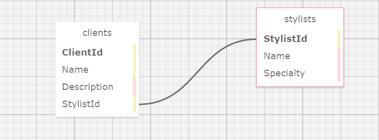
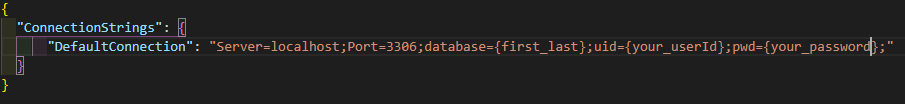

# 360 Scheduling

### A C-sharp application that keeps track of Stylist and Clients for Claires Hair Salon

### By Shaun Kent

## Technologies Used

* C#

* .NET 5.0

* MSTest

* Git/Github

* AspNet Core(Model, View, Controller)

* MySQL

* EntityCore Framework

## Description

A C# application for Pierre's friend Claire and her Hair Salon. The application allows the user to input new stylists (name, specialty) which will be stored in a database using MySQL. The application will also keep track of Clients for the salon allowing Claire to categorize her clients based on the which stylist they go too. 

## Schema

## Setup/Instillation Requirements

* Download .NET 5.0 SDK for Windows:`https://dotnet.microsoft.com/download/dotnet/thank-you/sdk-5.0.102-windows-x64-installer` 

* Download .NET 5.0 SDK for Mac: `https://dotnet.microsoft.com/download/dotnet/thank-you/sdk-5.0.100-macos-x64-installer`

* Open command line in directory where you want the project stored.

* In the command line enter: `git clone https://github.com/SKona306/EauClairesSalon.git`

* Open the newly cloned project directory in code editor of choice.

* Create you own database by copying the contents of `shaun_kent.sql` and importing them in MySql Workbench under a new query.

* Cd into the `HairSalon` directory and create a file by entering `touch appsettings.json`

* Navigate to the `appsettings.json` file and enter: 

* Run Application:
1. `cd` to root directory
2. In console enter: `cd HairSalon`
3. To build the project in the console enter: `dotnet build` 
4. To run the project in the console enter: `dotnet run`
5. To see application in browser press CTRL + click http link that appears after `dotnet run`
6. To exit program press CTRL + c

## Bugs in Application
* Currently the user can only add clients through the details page of the stylists. Currently working on allowing user to add Clients on home page.
## License 

[MIT](https://choosealicense.com/licenses/mit/)

## Contact Information

* shaunkent81@gmail.com